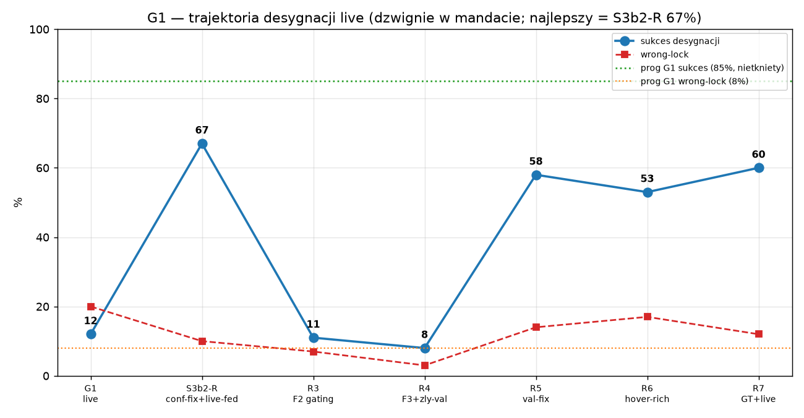
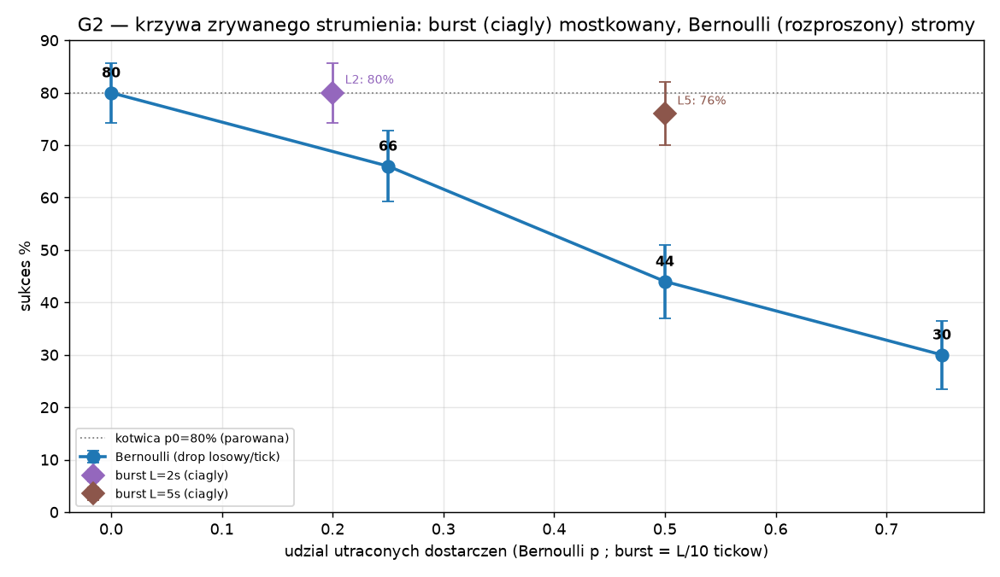
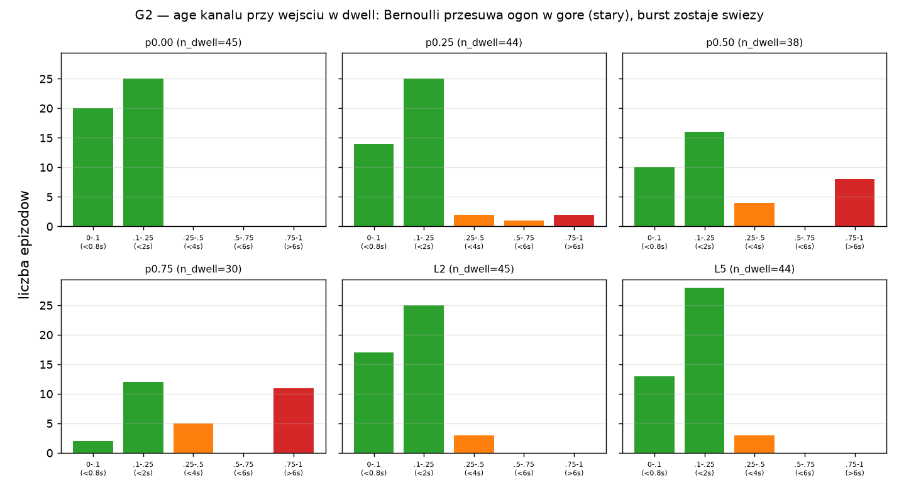

# RAPORT_3B — percepcja desygnowana: granica, mostkowanie, ustalenia

**Data:** 2026-07-30. **Zakres:** złożenie fazy 3b z artefaktów pomiarowych (S3b0–S3b4, DIAG-3B,
B1). **ZERO nowych pomiarów** — każda liczba pochodzi z zamrożonego artefaktu (tabela źródeł, §9).
**Zasada całej fazy:** MIERZĘ = RAPORTUJĘ; porażki dźwigni raportowane z atrybucją tak samo jak
sukcesy. Progi i sweep pozostają nietknięte.

---

## 1. Streszczenie

Faza 3b badała, czy wykonawca-dron sterowany polityką goal-conditioned potrafi dolecieć do
**desygnowanego** obiektu (komenda „fly to the {kolor} {kształt}"), gdy cel jest wskazywany przez
**żywy grounder wizualny** (YOLO-World @1 Hz), a nie przez wyrocznię. Odpowiedź brzmi: **potrafi, ale
nie na poziomie zamrożonej bramki.** Przy idealnej percepcji (kanał GT-fed) wykonawca osiąga **100%**
(sufit sweep, `results/s3b2/ceiling.json`). Przełączenie na żywy grounder zawaliło wynik do **12%**
(G1-FAIL, `results/s3b3/g1.json`) — strata **88 pp**, którą DIAG-3B rozłożył co do joule'a na jedną
przyczynę: **conf-shift** (polityka trenowana na conf=1.0, żywy conf ~0,02 → wejście OOD). Usunięcie
conf z kanału i trening na danych live-fed odzyskały większość straty i ustawiły **zmierzoną granicę
desygnacji live na 67% sukcesu / 10% wrong-lock** (`results/s3b2r/precond_R.json`) — przy **nietkniętym
progu 85% / 8%**. Siedem kolejnych iteracji dźwigni (kanał, budżet DAgger, procedura selekcji, skład
BC) nie przebiło 67%; kilka regresowało. Mandat dźwigni precondition został **wyczerpany i zamknięty**
klauzulą końca (R7); granica raportowana jest w stanie zmierzonym, a sweep 46600–46649 pozostaje
**czysty** do ewentualnego re-arm nowym mandatem.

Zostały **dwie ściany**, obie poza mandatem tej fazy. **Ściana 1 — precyzja dwell (kubełek B4,
~27–29 pp):** polityka dolatuje w pobliże celu (near-miss 90–96%), lecz nie utrzymuje `r_goal=0,25 m`,
gdy kanał celu jest stary w terminalnym martwym polu. Pięć dźwigni danych/procedury nie ruszyło tej
ściany, a ten sam rdzeń karmiony GT osiąga 100% — **to własność żywego interfejsu, nie danych ani
pojemności.** **Ściana 2 — wrong-lock (~10–17%):** odrębny problem z niestabilną dekompozycją
(pierwszy-lock-zły vs kradzież), mapujący się na regułę admisyjności 3c.

Charakteryzacja przesunięcia percepcyjnego G2 (zrywany strumień groundera) dała wynik pozytywny i
pouczający: **mostkowanie przerw jest asymetryczne.** Pojedyncza ciągła przerwa do 5 s jest mostkowana
niemal bez kosztu (**−4 pp**), a rozproszona utrata tej samej objętości degraduje stromo (**−36 pp**
przy p=0,5) — **różnica 32 pp z samej ciągłości**. Mechanizm: liczy się świeżość kanału w momencie
wejścia w dwell, a rozproszony dropout ją zatruwa, podczas gdy burst zostawia końcówkę dolotu
nietkniętą. Dropout **nie** wywołuje kradzieży locka (kradzież = 0 na wszystkich poziomach).

---

## 2. Architektura i kontrakty

Układ jest **trójtaktowy**, z trzema częstotliwościami sprzężonymi przez env:

- **Egzekutor 48 Hz** — pętla kontroli lotu (DSL-PID + klif bezpieczeństwa v1.0 + geofence areny +
  kontakt; `is_catastrophe` z D5), niezmieniona z fazy 3a.
- **Polityka 12 Hz** — `PolicyGC5` (GRU goal-conditioned): wejście 83 = feat64 (enkoder RGB 64²) +
  kin13 + dt1 + **kanał celu 5**; rdzeń GRU 28 608 param, total 155 110 (`results/s3b2r/train_log.json`).
  Wydaje setpoint 6-dim wykonywany przez egzekutor.
- **Grounder 1 Hz** — YOLO-World `yolov8s-worldv2` w izolowanym serwerze `.venv_s3b0`, odpytywany co
  12. krok polityki (256² kamera semantyczna, kontrakt D2). Wall-latencja mediana **25,4 ms** (p95
  42,8 ms) — z zapasem poniżej `L_deliver` 100 ms (`results/s3b3/g1.json`, potwierdza kontrakt D2).

**Kanał celu D3** to sedno kontraktu percepcja↔wykonawca. Ewoluował raz, dowodowo:

- **Wersja pierwotna (D3, zamrożona 2026-07-26):** 6-dim `(cx, cy, w, h, conf, age_s)`, ZOH między
  tickami, `age` rośnie od klatki źródłowej, brak locka → wektor zerowy + `age=AGE_MAX=8,0 s`.
- **Problem (DIAG-3B):** `conf` był w treningu GT-fed **stałą 1,0**, a na żywo ma medianę **0,013–0,017**
  (`results/diag3b/conf_audit.json`). Wejście degenerowane w treningu staje się miną OOD na wdrożeniu
  (ustalenie **F-3b-1**, §6).
- **Rewizja (ANEKS-3B):** kanał **5-dim** `(cx, cy, w, h, age_s)` — **conf usunięty z wejścia**
  polityki (nadal logowany per tick, ale nie podawany; assert `conf_nie_w_wejsciu` = target_dim==5).
  Reszta kontraktu (tick, `L_deliver` → `k_del=k_src+2`, ZOH, no-lock, `AGE_MAX`) — bez zmian.

Ślad aneksów D3-ANEKS-3B-1..7 (każdy = jedna decyzja, jeden commit):

| aneks | powód (dźwignia) | werdykt |
|---|---|---|
| 3B-1 (kanał) | conf usunięty z wejścia + dane live-fed | **67%** — granica; conf-fix potwierdzony |
| 3B-2 (percepcja) | DIAG-lite: B4=27 pp dominuje; dźwignie L1/L2/L3 warunkowe | L3 STOP (bez treningu) |
| 3B-3 (precyzja) | DIAG-B4 → F1 EMA / F2 gating / F3 +runda DAgger | F2+F3 aktywne → R3 |
| 3B-4 (czysty test F3) | F2 dezaktywowane na stałe (F-3b-2); czysty test F3 | F2 off; F3 na rollout + |
| 3B-5 (selekcja) | naprawa selekcji checkpointu (F-3b-3): val stratyfikowany 8%/rundę | selekcja naprawiona |
| 3B-6 (hover-rich) | BC 300 std + 100 hover-rich (szybki ekspert; cel: B4) | **szkodliwe** (F-3b-4) |
| 3B-7 (kurikulum) | BC 300 live + 100 GT-fed; **klauzula końca** | **neutralne**; mandat zamknięty |

---

## 3. G1 — granica desygnacji live

Pełna trajektoria sukcesu przez wszystkie iteracje mandatu:

Liczby i atrybucja mechanizmu (każdy wiersz = jeden bieg z zamrożonym artefaktem):

| bieg | dźwignia | sukces | wrong-lock | mechanizm / dowód |
|---|---|---|---|---|
| G1 live | żywy YOLO zamiast GT | **12,0%** | 20,0% | conf-shift maskuje wszystko (DIAG-3B: (i)+(ii)=0, (iii)=88 pp) |
| **S3b2-R** | conf usunięty + live-fed | **67,0%** | 10,0% | +55 pp z samej naprawy conf; kierunek trafny |
| R3 | F2 pixel-IoU gating | 11,0% | 7,0% | **regresja** — gating odrzuca legalne boxy dolotu (F-3b-2; 741/133 odrzuceń) |
| R4 | F3 +1 runda DAgger | 8,0% | 3,0% | rollout r4 72%, ale best-val@6 wybrał niedotrenowany model (F-3b-3) |
| R5 | naprawa selekcji + F3 | 58,0% | 14,0% | selekcja naprawiona (8→58, +50 pp), ale F3 net-negatywny na wdrożeniu |
| R6 | hover-rich BC | 53,0% | 17,0% | szybki ekspert → rozjazd etykiet (F-3b-4); B4 27→37 pp |
| R7 | kurikulum GT+live | 60,0% | 12,0% | **neutralny**; B4 27→29 pp — GT-fed nie przenosi zawisu na interfejs live |

Czytając tę tabelę uczciwie: **jedyny bieg, który cokolwiek dodał, to conf-fix (S3b2-R).** Wszystko
po nim to albo regresja (R3, R4, R6), albo częściowy odzysk regresji bez przebicia bazy (R5, R7).
Najlepszy model przez całą fazę pozostaje **S3b2-R = 67%** (`ckpt/s3b2r/policy_gc5.pt`).

**Dekompozycja 88 pp (DIAG-3B).** To najważniejszy pojedynczy pomiar fazy. Strata G1 rozkłada się:
poza-FOV fałszywe locki **0 pp**, błędy groundera w FOV **0 pp**, conf-shift + polityka **88 pp**
(`results/diag3b/decompose.json`). Nawet oracle karmiący kanał wyłącznie idealnymi lockami, ale z
żywym conf, daje wciąż 12%; ten sam oracle z **conf wymuszonym 1,0 → 80%** (`oracle_conf1.json`). Czyli
sam conf odpowiada za ~68 z 88 pp, a reszta (80→100, ~20 pp) to gęstość/jakość locków, widoczna
**dopiero po naprawie conf**. To dowodowo obaliło wcześniejszą hipotezę z RAPORT_S3B3 (rozjazd
dystrybucji klatek + mylenie kształtu jako główne przyczyny) — te mechanizmy kontrybuują 0 pp.

### Dwie ściany

**Ściana 1 — B4, precyzja dwell (~27–29 pp), własność żywego interfejsu.** Kubełek B4 = „lock poprawny
przez cały epizod, epizod przegrany": dron dolatuje ≤0,5 m (near-miss 96,3% w DIAG-B4,
`results/s3b2r/diag_b4.json`), box jest dokładny (~0,5 px, jak przy sukcesie), a mimo to polityka nie
utrzymuje `r_goal=0,25 m` w terminalnym martwym polu (korelacja Δbox↔Δhover tylko 0,22). Dowód, że to
**interfejs, nie dane ani pojemność**, jest złożony z pięciu niezależnych prób:

- **budżet** (F3, +runda DAgger): rollout rośnie (55→72%), wdrożenie nie — net-negatywny (R4, R5);
- **procedura** (naprawa selekcji Z1): odzyskała 8→58%, ale nie ruszyła B4 (27→33 pp, R5);
- **dane u źródła** (hover-rich BC): B4 27→37 pp — **pogorszyło** (R6);
- **kurikulum GT+live** (domieszka reżimu, który dowodnie potrafi zawis): B4 27→29 pp — **bez efektu**
  (R7). To rozstrzyga: nawet 100 epizodów GT-fed w treningu nie przenosi umiejętności dwell na politykę
  żyjącą na żywym kanale;
- **sufit wykonalności:** ten **sam rdzeń** karmiony GT-fed osiąga **100%** (`ceiling.json`).

Wniosek: umiejętność dwell istnieje w rdzeniu (dowód GT-fed 100%), ale nie transferuje się na reżim,
w którym kanał jest stary przy terminalu — bo grounder traci desygnowanego z kadru na <0,5 m
(in-FOV spada do **1,5%**, DIAG-3B T2). To ograniczenie **percepcyjno-geometryczne**, nie treningowe.

**Ściana 2 — wrong-lock (~10–17%), problem odrębny.** Dekompozycja jest **niestabilna między biegami**:
R6 dało pierwszy-lock-zły 7 pp / kradzież 5 pp, R7 odwrotnie 2 pp / 6 pp, a pod dropoutem G2 kradzież
spada do 0. Suma trzyma się ~10–17%, ale mechanizm zmienia proporcje — sygnał, że to nie pojedynczy
defekt, lecz splot dryfu w martwym polu i sporadycznego mylenia obiektów A1 (współdzielony kolor).

**Prób NIE rewidowano.** Bramka G1 (85%/8%) jest nietknięta; sweep 46600–46649 nie był uruchamiany na
żadnym modelu poza sufitem — pozostaje czysty. GT-fed 100% stoi jako dowód, że zadanie jest wykonalne
dla wykonawcy; brakuje wyłącznie percepcji live o jakości wystarczającej w terminalu.

---

## 4. G2 — zrywany strumień semantyczny

Charakteryzacja (S3b4) mierzyła, jak polityka S3b2-R (frozen) znosi **przerwy w dostarczeniach**
groundera — dropout na punkcie dostarczenia, kontrakt D3 (ZOH + rosnący age) mostkuje lukę jak przy
naturalnym braku locka. Sceny parowane 46500–46549 (50 ep/poziom, identyczne między poziomami). To
**charakteryzacja bez progu** (ramowanie G2).

| oś | poziom | sukces | Δ vs p0 | wrong-lock (kradzież) | eff-no-det |
|---|---|---|---|---|---|
| Bernoulli | p=0,00 | 80,0% ±5,7 | — | 10% (0) | 72,8% |
| | p=0,25 | 66,0% ±6,7 | −14 | 12% (0) | 79,0% |
| | p=0,50 | 44,0% ±7,0 | −36 | 16% (0) | 87,2% |
| | p=0,75 | 30,0% ±6,5 | −50 | 14% (0) | 93,6% |
| burst | L=2 s | 80,0% ±5,7 | **0** | 12% (0) | 76,6% |
| | L=5 s | 76,0% ±6,0 | **−4** | 8% (0) | 80,6% |

**Asymetria to wynik główny.** L=5 s usuwa 50% ticków (5/10) **ciągle** i kosztuje 4 pp; p=0,50 usuwa
~47% ticków **losowo** i kosztuje 36 pp — ta sama objętość utraty, **różnica 32 pp**. Polityka mostkuje
pojedynczą lukę 2–5 s niemal idealnie (ZOH + pamięć rdzenia GRU), ale rozproszona utrata przerzedza
**krytyczne odświeżenia** rozsiane po epizodzie.

**Mechanizm: świeżość kanału przy wejściu w dwell.** Histogram age w momencie wejścia w `r_goal`:

Przy p=0 wszystkie epizody wchodzą w dwell ze świeżym kanałem (age_n<0,25, <2 s). Przy p=0,50/0,75
rośnie ogon w górnym binie — **8, potem 11 epizodów wchodzi w dwell z kanałem starszym niż 6 s** →
utrata precyzji zawisu (dokładnie ściana B4) → więcej porażek. Burst L5 zostaje świeży jak p0
(`[13,28,3,0,0]`), bo poza oknem przerwy strumień jest nienaruszony i **końcówka dolotu wciąż dostaje
świeże odświeżenia**. To mechanistycznie tłumaczy łagodność burstu: liczy się świeżość w terminalnym
momencie dwell, a burst (zwykle) zostawia ją nietkniętą.

**Kradzież = 0 pod dropoutem.** Na wszystkich poziomach dekompozycja wrong-lock daje kradzież 0;
wzrost wrong-lock (do 16% przy p=0,5) to **„inne" — dryf polityki w martwym polu** przy zagłodzonym
kanale, nie aktywna kradzież percepcyjna. To istotny wkład do reguły admisyjności 3c (§8): tłumienie
dostarczeń w dwell nie tworzy kradzieży.

**Uczciwe zdanie o kotwicy.** p0 = 80% na 46500–46549, podczas gdy precond-R = 67% na pełnych
46500–46599. p0 jest deterministycznie identyczne z precond per-seed (brak dropoutu, ta sama dynamika),
więc **13 pp to trudność wewnątrz-komórkowa pierwszej połowy puli**, nie kontaminacja: skład komórek
K×A jest w obu połówkach niemal identyczny, a te same komórki wypadły łatwiej na pierwszych 50 seedach
(np. K8_A1 75% tu vs 43,8% na 100; wrong-lock 10% w obu). Krzywa jest **parowana**, więc kształt
(Δ vs p) jest ważny; wartości bezwzględne są ~13 pp optymistyczne względem populacji 67%.

---

## 5. Baseline B1 (wiersz odniesienia D7)

B1 (`RAPORT_BASELINE_GRU`, `results/baseline_gru/summary.json`) charakteryzuje **czystego wykonawcę
GRU bez kanału celu** (ścieżka 3a, obs 78), 10 seedów 45010–45019, procedura v2. Nominal na T0 =
**100,0 ± 0,0%** — GRU jest w pełni kompetentnym wykonawcą, gdy nie ma dystraktorów. Drabina trudności
(7 poziomów, mean ± sd) degraduje monotonicznie z liczbą wabików:

| poziom | K wabików | sukces | saliency IoU (uwaga↔cel) |
|---|---|---|---|
| T0 | 0 | 100,0 ± 0,0 | 0,321 ± 0,050 |
| T1 | 0 | 100,0 ± 0,0 | 0,329 ± 0,050 |
| T2 | 0 | 75,8 ± 5,2 | 0,232 ± 0,029 |
| T2a | 1 | 60,6 ± 4,7 | 0,161 ± 0,026 |
| T2b | 2 | 46,2 ± 3,6 | **0,124 ± 0,018** |
| T2c | 3 | 36,0 ± 4,8 | 0,104 ± 0,018 |
| T3 | 4 | 24,2 ± 3,2 | 0,103 ± 0,019 |

Krzywa IoU saliency maleje z K równolegle do sukcesu: uwaga wykonawcy pokrywa się z maską celu
najlepiej bez wabików (~0,33) i rozprasza się z rosnącym K (do ~0,10 na T3). To wartość odniesienia,
nieorzekająca. Koszt kanoniczny cyklu v2 = **41 min/seed** (2458 ± 85 s, 9 czystych seedów; seed 45013
wykluczony z czasów — laptop spał ~3,5 h, GPU wróciło na obniżonych zegarach, ale wyniki naukowe 45013
są zegaro-niezależne i użyte).

**Nota o drabinie B1 vs sanity.** Sanity-policy P2R degradowała 100/100/64/46/36/24/16; trenowany GRU
jest nieco wyżej (100/100/75,8/60,6/46,2/36,0/24,2), z tą samą tendencją. Różnica na T2 (75,8 vs 64)
jest **skonfundowana** dwoma czynnikami naraz: zmianą procedury v1→v2 **oraz** różnym n (P2R vs 10
seedów B1). Nie należy jej czytać jako czystego zysku architektury — to wartość odniesienia, nie test.

---

## 6. Ustalenia inżynierskie F-3b-1..4

Cztery ustalenia przenośne poza tę fazę, każde z jednozdaniowym dowodem:

- **F-3b-1 — zdegenerowane wejście jest miną OOD.** Cecha stała w treningu (conf=1,0) staje się
  poza-rozkładowa na wdrożeniu (żywy conf ~0,02) i maskuje wszystkie inne przyczyny, aż do zera.
  *Dowód:* DIAG-3B — ten sam oracle box daje 12% z żywym conf i 80% z conf=1,0 (+68 pp z samej cechy).
- **F-3b-2 — pixel-IoU gating jest nieadekwatny do dynamiki dolotu.** Kolejne boxy wskazanego mają
  IoU≈0 podczas szybkiego zbliżania (obiekt przesuwa się w kadrze 256 między tickami), więc gating
  na IoU≥0,2 zamraża lock na starej pozycji. *Dowód:* R3 odrzuciło 741 (train) / 133 (eval) legalnych
  dostarczeń, regresja 67→11%.
- **F-3b-3 — val-BC-only łamie selekcję checkpointu, gdy agregat dominuje DAgger.** Walidacja na samych
  czystych epizodach BC minimalizuje się wcześnie i wybiera niedotrenowany model, gdy trening jest
  zdominowany danymi on-policy. *Dowód:* R4 best-val@epoka 6 (vs r0-r3 @96–119) → 8%; stratyfikowany
  val (8%/rundę) przesunął best-epokę r4 na 119 → 58% (R5).
- **F-3b-4 — profil prędkości eksperta jest częścią rozkładu etykiet.** Szybszy ekspert (v_max=2,0)
  produkuje setpointy, których polityka nie wykonuje własną dynamiką → rozjazd rozkładu etykiet BC vs
  DAgger/eval. *Dowód:* R6 hover-rich (szybki ekspert) B4 27→37 pp, sukces 53%; R7 z profilem std
  zgodnym (p95 |v| 0,919–0,936 we wszystkich źródłach) nie miał tego rozjazdu.

---

## 7. Przyszłe mandaty (nazwane, z dowodami; NIEAKTYWNE)

Żadna z poniższych nie była uruchamiana; każda wymaga osobnego mandatu człowieka. Podane z dowodem, bo
faza je zidentyfikowała, nie żeby je autoryzować.

- **L1 — rewizja FOV martwego pola.** Poszerzyć FOV kamery / stożek widoczności wskazanego, by cel nie
  znikał terminalnie. *Dowód celowości:* DIAG-3B T2 — in-FOV spada z 100% (≥0,5 m) do 1,5% (<0,5 m);
  to bezpośrednie źródło starości kanału napędzającej ścianę B4. (Bramka offline nieuruchomiona —
  ANEKS-3B-2 L1 nieaktywna.)
- **Mikro-filtr temporalny na nieregularnych tickach.** Filtr w przestrzeni świata (po back-projekcji),
  nie pixel-IoU, respektujący nieregularną kadencję dostarczeń. *Dowód:* F-3b-2 — pixel-IoU zawiódł
  właśnie dlatego, że zakłada nakładanie się kolejnych boxów; metryka światowa tego nie zakłada.
- **Tłumienie dostarczeń w fazie dwell.** Świadomie wstrzymać odświeżenia, gdy dron zawisa nad celem
  (cel i tak poza kadrem). *Dowód:* G2 — burst (ciągłe tłumienie) kosztuje ≤4 pp i kradzież=0; tłumienie
  w terminalu jest niemal darmowe i nie tworzy dryfu do dystraktora.
- **Hybryda OWLv2-na-pierwszy-lock.** Użyć OWLv2 (in-FOV 99%, DIAG-3B T3) dla krytycznego pierwszego
  locka, YOLO-World (63 ms) dla tanich odświeżeń. *Dowód:* pierwszy-lock-zły to jeden z modów wrong-lock
  (ściana 2); OWLv2 ma wyższą precyzję pierwszego locka, kosztem 1,6 s raz na epizod.
- **Warunki re-arm.** Sweep 46600–46649 jest **czysty** (uruchamiany tylko dla sufitu GT-fed=100%);
  każda z powyższych dźwigni może być zmierzona przez G1-R na tym sweepie po nowym mandacie, bez
  kontaminacji.

---

## 8. Most do 3c — reguła admisyjności

Faza 3c powinna wprowadzić **regułę admisyjności desygnacji** z parametrami zmierzonymi tutaj,
kryjącą oba mody wrong-locka (ściana 2) oraz najgorszy tryb ściany 1 (dwell na starym kanale):

- **conf pierwszego locka jako filtr.** Rozkłady zmierzone: żywy YOLO in-FOV med **0,017**, OWLv2 in-FOV
  **0,177** (DIAG-3B T4). Próg conf na **pierwszy** lock odrzucałby złe pierwsze desygnacje → celuje w
  mod **pierwszy-lock-zły**. Uwaga: conf ma być sygnałem niepewności dla **osłony/admisyjności**, nie
  dla wykonawcy (F-3b-1 — nie wolno go wracać do wejścia polityki).
- **próg age-at-dwell-entry z krzywej G2.** G2 pokazało, że epizody wchodzące w dwell z age_n>6 s
  zawodzą nieproporcjonalnie. Reguła: **nie commituj dwell**, gdy age kanału przekracza próg → celuje
  w dryf w martwym polu (mod „inne"/kradzież) i część ściany B4.
- **world-gating na kradzież-w-locie.** Gating na dystansie po back-projekcji (nie pixel-IoU, F-3b-2)
  odrzucałby nadpisanie poprawnego locka boxem innego obiektu → mod **kradzież**.
- **geofence bez zmian.** Klif bezpieczeństwa D5 (v1.0 + geofence areny + kontakt) zostaje jako warstwa
  ostateczna; katastrof w całej fazie **0**.

Reguła admisyjności jest czystym następnym krokiem, bo obie ściany 3b są problemami **decyzji o
zaufaniu do percepcji**, a nie wykonania — a to jest dokładnie zakres 3c.

---

## 9. Tabela źródeł i przegląd spójności

Każda liczba raportu ma źródło; rozbieżności wypisane, nie uzgadniane.

| twierdzenie | liczba | źródło |
|---|---|---|
| sufit GT-fed | 100% (50/50) | `results/s3b2/ceiling.json` |
| G1 live | 12% / wrong-lock 20% | `results/s3b3/g1.json`, RAPORT_S3B3 |
| dekompozycja 88 pp | (i)0/(ii)0/(iii)88 | `results/diag3b/decompose.json`, RAPORT_DIAG_3B |
| conf test | oracle-live 12% → conf1.0 80% | `results/diag3b/oracle_conf1.json` |
| granica S3b2-R | 67% / wrong-lock 10% | `results/s3b2r/precond_R.json`, RAPORT_S3B2R |
| R3/R4/R5/R6/R7 | 11 / 8 / 58 / 53 / 60% | `results/s3b2r{3,4,5,6,7}/precond_R.json` |
| B4 (S3b2-R) | 27 pp | `results/s3b2r/diag_b4.json`, RAPORT_S3B2R2 |
| G2 krzywa | p .25/.5/.75 = 66/44/30; L2/L5 = 80/76 | `results/s3b4/measure.json`, RAPORT_S3B4 |
| B1 nominal / drabina | 100±0 / …/24,2 | `results/baseline_gru/summary.json` |

**Rozbieżności odnotowane (jawnie):**

1. **B4 „27 vs 29 pp".** DIAG-lite mierzy 27 pp na modelu S3b2-R (RAPORT_S3B2R2), diag_r6 mierzy 29 pp
   na modelu R7 (`results/s3b2r7/diag_r6.json`). To **różne modele**, nie sprzeczność; jako baza
   ściany 1 podaję 27 pp (S3b2-R), z rozrzutem 27–37 pp między biegami (R6=37, R5=33, R7=29).
2. **near-miss B4: 96,3% vs 81% vs 89,7%.** DIAG-B4 na S3b2-R = 96,3% (`diag_b4.json`), diag_r6 na R6 =
   81%, na R7 = 89,7%. Różne modele i lekko różna definicja (near-miss B4 vs near-miss porażek). Trend
   wspólny: polityka niemal zawsze dolatuje; różni się utrzymanie.
3. **tick-precision designated: 48% (G1) vs 20,8% (S3b2-R).** G1 (RAPORT_S3B3) mierzy 48% na polityce,
   która **nie dolatuje** (no-arrival 62%) → spędza ticki daleko, gdzie cel jest w kadrze. S3b2-R mierzy
   20,8% na polityce, która **dolatuje** (67%) → spędza ticki w terminalnym martwym polu. Zgodne z
   DIAG-3B in-FOV 20,8% dla lotu, który dochodzi do celu — to **różnica rozkładu ticków z trajektorii**,
   nie pomiaru.
4. **Korekta root-cause S3B3→DIAG-3B.** RAPORT_S3B3 hipotezował rozjazd dystrybucji klatek + mylenie
   kształtu jako główne przyczyny; DIAG-3B obalił to dowodowo (0 pp) i wskazał conf-shift. Raportuję
   **rozwiązaną** wersję (DIAG-3B), odnotowując, że wcześniejsza interpretacja została skorygowana.
5. **kotwica G2 p0=80 vs populacja 67.** Wyjaśnione w §4 — trudność wewnątrz-komórkowa pierwszej połowy
   puli; krzywa parowana, kształt ważny, wartości bezwzględne ~13 pp optymistyczne.
6. **„granica 67/10" vs „G1 12/20".** Terminologia: 12%/20% to **surowy** G1 live (S3b3); 67%/10% to
   **zmierzona granica** na najlepszym modelu (S3b2-R). Próg bramki niezmiennie 85%/8%.

Poza tymi sześcioma pozycjami przegląd nie znalazł niespójności między artefaktami: trajektoria
12→67→11→8→58→53→60 jest zgodna między RAPORT_S3B2R3/4/5/6/7 a `precond_R.json` każdego biegu; sufit
100% i katastrofy 0 są spójne we wszystkich sesjach.

---

*Faza 3b: komplet pomiarów zamknięty. Granica desygnacji live zmierzona (67%/10%) przy nietkniętym
progu (85%/8%) i czystym sweepie; mostkowanie zrywanego strumienia scharakteryzowane (asymetryczne);
cztery ustalenia inżynierskie i dwie ściany udokumentowane. Dalsze dźwignie i faza 3c — po decyzji
człowieka.*
